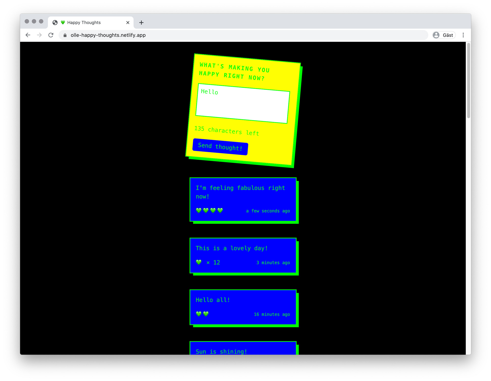

# Happy Thoughts

Twitter like app where you can post your happy thoughts, read others and give them a like. React site using the useEffect hook and a joint API to fetch and post data.

Used Postman to explore the API with POST and GET commands. 

Conditionally renders different styles and elements with the ternary operator e.g.
a loading component that conditionals renders while fetching the data. 

Time codes added using Moment library 

## Core Tech
* React
* useEffect Hook
* useState Hook
* Fetch
* Postman
* CSS3

## Screenshot

## View it live
olle-happy-thoughts.netlify.com
